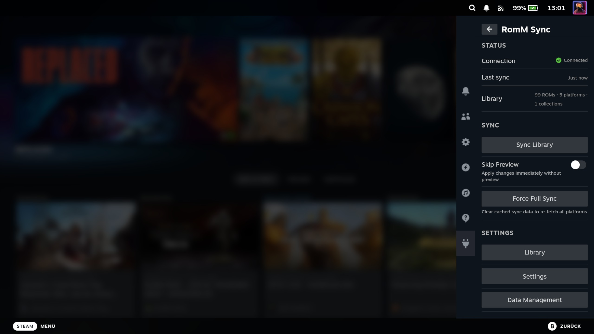

# Syncing Your Library

Syncing fetches your RomM game library and creates Non-Steam shortcuts in Steam for every game. After syncing, your
games appear in the Steam Library with cover art, metadata, and organized into collections.

## How Sync Works

1. The plugin fetches all ROMs from your RomM server (filtered by your enabled platforms)
2. For each ROM, a Non-Steam shortcut is created in Steam via the SteamClient API — no restart required
3. Cover art from RomM is applied as the portrait grid image
4. If you have a SteamGridDB API key configured, hero banners, logos, and wide grid images are also fetched
5. Metadata (description, developer, genres, release date) is cached and displayed in the plugin's custom game detail
   panel
6. Steam collections are created per platform (e.g. "RomM: Game Boy Advance (steamdeck)")

## Starting a Sync

1. Open the QAM and navigate to the plugin
2. Tap **Sync Library** on the main page
3. A progress bar shows the sync status
4. When complete, a toast reports what actually changed — the true delta, not the total in your library. It shows the
   number of shortcuts added and/or removed this run (e.g. "Sync complete — 42 added, 3 removed."), omitting a part that
   is zero. If nothing changed, it reads "Library up to date."

<!-- Screenshot: Sync in progress with progress bar -->

You can tap **Cancel Sync** to stop mid-sync. Games already added will remain. A cancelled sync never removes any Steam
collections — stale-collection cleanup only runs after a sync finishes in full, so cancelling can never wipe the
collections for platforms the run did not reach.

## Per-Platform Toggles

Not every platform in your RomM library needs to be synced to Steam. Use the **Platforms** page to enable or disable
individual platforms.

1. From the main page, tap **Platforms**
2. Each platform shows its name and ROM count
3. Toggle platforms on or off
4. Use **Enable All** / **Disable All** for bulk changes
5. Only enabled platforms are included in the next sync

All platforms are enabled by default until you change a toggle. Turning one platform off affects only that platform —
every other platform stays enabled and keeps syncing.

<!-- Screenshot: Platforms page with toggle switches and ROM counts -->

## Collections

The plugin automatically creates Steam collections for each synced platform. Collection names include your machine's
hostname to avoid conflicts if you run the plugin on multiple devices:

- `RomM: Nintendo 64 (steamdeck)`
- `RomM: Game Boy Advance (steamdeck)`
- `RomM: PlayStation (htpc)`

Collections appear in Steam's library sidebar and can be used to browse games by platform.

### Syncing RomM collections

The **Collections** page splits collections into three sub-tabs plus a dedicated top-level toggle for RomM favorites:

- **Sync RomM favorites** (top-level toggle) — the user collection RomM auto-manages as your favorites. Always exactly
  one per account, so it sits above the sub-tabs as a single switch.
- **My** sub-tab — your other user-created collections
- **Smart** sub-tab — filter-based collections that resolve membership at query time, so syncing always picks up the
  current matches
- **Franchise** sub-tab — auto-generated franchise groupings (IGDB)

Each sub-tab shows its visible count in the section header (e.g. `MY COLLECTIONS (4)`) and lets you toggle individual
collections, or use the paired **Enable All** / **Disable All** buttons to bulk-toggle just that sub-tab. The global
**Show collection games in platform groups** toggle controls whether games pulled in via a collection also get added to
their platform's Steam group.

## Artwork

Each synced game gets up to five types of artwork:

| Type                  | Source      | Where It Appears                |
| --------------------- | ----------- | ------------------------------- |
| Portrait Grid (cover) | RomM        | Library grid tiles, collections |
| Hero Banner           | SteamGridDB | Game detail page background     |
| Logo                  | SteamGridDB | Title overlay on hero banner    |
| Wide Grid             | SteamGridDB | Recent games shelf, list view   |
| Icon                  | SteamGridDB | Taskbar, small UI elements      |

Cover art is always applied from RomM. The other four types require a
[SteamGridDB API key](configuration.md#steamgriddb-api-key). Games without a SteamGridDB match will show Steam's default
placeholders for those slots.

You can refresh artwork for any individual game from its
[game detail page](managing-games.md#refreshing-artwork-and-metadata).

## Re-Syncing

Running sync again updates your library with any changes from RomM (new ROMs, removed platforms, etc.). Existing
shortcuts are updated rather than duplicated.

## Removing Shortcuts

To remove synced games, use the **Danger Zone** page. See
[Troubleshooting — Danger Zone](troubleshooting.md#danger-zone) for details on the available removal options.

If you delete a synced game directly from **Steam's own library** (rather than the Danger Zone), the next sync brings it
back. The plugin notices the shortcut is gone at sync start and re-creates it, so deleting through Steam is not a
permanent way to remove a RomM game — use the Danger Zone for that.

---

**Previous:** [Configuration](configuration.md) | **Next:** [Managing Games](managing-games.md)
